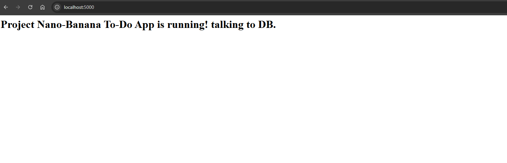
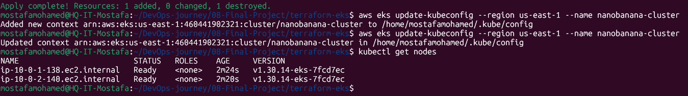
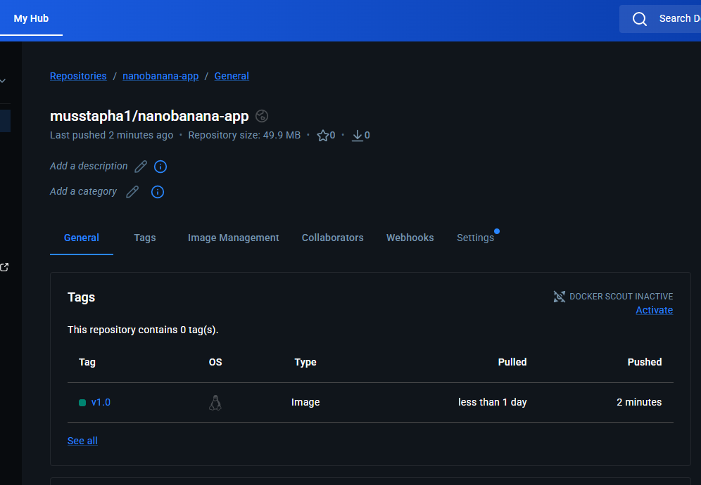
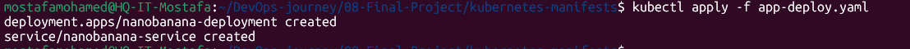
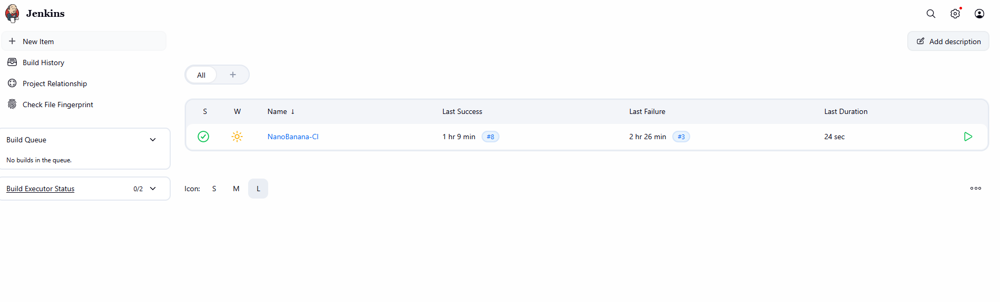

# 🍌 Nano-Banana — End-to-End DevOps Pipeline

> Taking a Python web application from a local `docker-compose up` to a **live, publicly accessible URL on AWS EKS** — fully automated, monitored, and production-grade.


---

## 🗺️ The Full Pipeline at a Glance

```
  👨‍💻 Developer           🔧 Jenkins              🐳 DockerHub
  ─────────────          ──────────────          ─────────────
  Edit code         →    Pull from GitHub    →   Push image
  git push               Run tests               tag: build-$NUM
                         docker build
                              │
                              ▼
                    ☁️  AWS EKS Cluster
                    ──────────────────────────────────────
                    │  Flask Pod  │◄──── ELB (public URL)
                    │  PgSQL Pod  │◄──── PVC (EBS volume)
                    │  Prometheus │
                    │  Grafana    │◄──── Real-time metrics
                    ──────────────────────────────────────
```
<<<<<<< HEAD

---

## 📁 Project Structure

```
Nano-Banana/
├── app/                    # Flask application
│   ├── app.py
│   └── requirements.txt
├── Dockerfile              # Container definition
├── docker-compose.yml      # Local dev environment
├── Jenkinsfile             # CI/CD pipeline as code
├── terraform/              # AWS infrastructure (VPC + EKS)
│   ├── main.tf
│   ├── variables.tf
│   └── outputs.tf
├── k8s/                    # Kubernetes manifests
│   ├── flask-deployment.yaml
│   ├── postgres-deployment.yaml
│   └── flask-service.yaml
├── monitoring/             # Helm values for Prometheus stack
└── images/                 # Proof of execution screenshots
```

---

## Phase 1 — Containerisation 🐳

> **Goal:** Package the app and its database into containers and confirm they talk to each other locally before touching any cloud infrastructure.

### What I built
- A `Dockerfile` that packages the Python Flask app with all its dependencies in a reproducible, portable image
- A `docker-compose.yml` that spins up both the **web app** and **PostgreSQL** as separate containers on a shared network — one command starts the entire local stack
- Verified the full flow locally: app starts, connects to the database, reads and writes data correctly

### Result

)

*Flask app running locally, connected to PostgreSQL — both containers healthy*

---

## Phase 2 — Infrastructure as Code ☁️

> **Goal:** Stop clicking in the AWS console. Provision the entire cloud environment automatically with a single `terraform apply`.

### What I built
- Modular Terraform code split across `main.tf`, `variables.tf`, and `outputs.tf` — clean, readable, reusable
- A custom **AWS VPC** with public and private subnets across multiple availability zones
- A fully managed **AWS EKS cluster** with worker nodes — AWS handles the control plane, I manage the workloads
- Connected local `kubectl` to the live cluster and confirmed nodes were `Ready`

### Why Terraform over clicking in the console
Every resource is version-controlled. A teammate can clone the repo and run `terraform apply` to get an identical environment in minutes. `terraform destroy` tears everything down cleanly — no forgotten resources racking up charges.

### Result


*Terraform apply completing successfully — EKS nodes showing Ready status in kubectl*

---

## Phase 3 — Production Deployment on Kubernetes 🚀

> **Goal:** Deploy the app and database to the live EKS cluster — externally accessible, data-persistent, and credentials secured.

### What I built
- Pushed the Docker image to **DockerHub** so EKS worker nodes can pull it from anywhere
- Wrote Kubernetes `Deployment` and `Service` manifests for both the Flask app and PostgreSQL
- Secured database credentials using **Environment Variables** injected at runtime — the password never appears in any file committed to Git
- Exposed the application to the internet via an **AWS Elastic Load Balancer (ELB)** — Kubernetes provisions it automatically when the Service type is `LoadBalancer`

### Result

**1 — Image on DockerHub, ready to be pulled by EKS:**



=======

---

## 📁 Project Structure

```
Nano-Banana/
├── app/                    # Flask application
│   ├── app.py
│   └── requirements.txt
├── Dockerfile              # Container definition
├── docker-compose.yml      # Local dev environment
├── Jenkinsfile             # CI/CD pipeline as code
├── terraform/              # AWS infrastructure (VPC + EKS)
│   ├── main.tf
│   ├── variables.tf
│   └── outputs.tf
├── k8s/                    # Kubernetes manifests
│   ├── flask-deployment.yaml
│   ├── postgres-deployment.yaml
│   └── flask-service.yaml
├── monitoring/             # Helm values for Prometheus stack
└── images/                 # Proof of execution screenshots
```

---

## Phase 1 — Containerisation 🐳

> **Goal:** Package the app and its database into containers and confirm they talk to each other locally before touching any cloud infrastructure.

### What I built
- A `Dockerfile` that packages the Python Flask app with all its dependencies in a reproducible, portable image
- A `docker-compose.yml` that spins up both the **web app** and **PostgreSQL** as separate containers on a shared network — one command starts the entire local stack
- Verified the full flow locally: app starts, connects to the database, reads and writes data correctly

### Result


*Flask app running locally, connected to PostgreSQL — both containers healthy*

---

## Phase 2 — Infrastructure as Code ☁️

> **Goal:** Stop clicking in the AWS console. Provision the entire cloud environment automatically with a single `terraform apply`.

### What I built
- Modular Terraform code split across `main.tf`, `variables.tf`, and `outputs.tf` — clean, readable, reusable
- A custom **AWS VPC** with public and private subnets across multiple availability zones
- A fully managed **AWS EKS cluster** with worker nodes — AWS handles the control plane, I manage the workloads
- Connected local `kubectl` to the live cluster and confirmed nodes were `Ready`

### Why Terraform over clicking in the console
Every resource is version-controlled. A teammate can clone the repo and run `terraform apply` to get an identical environment in minutes. `terraform destroy` tears everything down cleanly — no forgotten resources racking up charges.

### Result


*Terraform apply completing successfully — EKS nodes showing Ready status in kubectl*

---

## Phase 3 — Production Deployment on Kubernetes 🚀

> **Goal:** Deploy the app and database to the live EKS cluster — externally accessible, data-persistent, and credentials secured.

### What I built
- Pushed the Docker image to **DockerHub** so EKS worker nodes can pull it from anywhere
- Wrote Kubernetes `Deployment` and `Service` manifests for both the Flask app and PostgreSQL
- Secured database credentials using **Environment Variables** injected at runtime — the password never appears in any file committed to Git
- Exposed the application to the internet via an **AWS Elastic Load Balancer (ELB)** — Kubernetes provisions it automatically when the Service type is `LoadBalancer`

### Result

**1 — Image on DockerHub, ready to be pulled by EKS:**


>>>>>>> 3b9eb2e21e0801eb0528e2c22824a95152bcbfae
**2 — Manifests applied to the live cluster:**



**3 — Application live on public AWS ELB URL, connected to PostgreSQL ✅**

<<<<<<< HEAD


=======
>>>>>>> 3b9eb2e21e0801eb0528e2c22824a95152bcbfae
---

## Phase 4 — CI/CD Automation with Jenkins ⚙️

> **Goal:** Make manual deployments impossible. Every `git push` triggers a full pipeline — test, build, push, deploy. Zero human steps.

### What I built
- A declarative `Jenkinsfile` (Pipeline-as-Code) that defines every stage of the delivery lifecycle — the pipeline lives in the repo alongside the code
- Jenkins pulls from GitHub automatically, builds the Docker image, and pushes it to DockerHub using securely stored credentials
- The final stage sends `kubectl` commands directly to the EKS cluster to roll out the new image — no SSH, no manual steps

### Real challenge I solved — Docker-out-of-Docker (DooD) 🔧
Running `docker build` inside a Jenkins container requires the container to communicate with the host's Docker socket. This causes a socket permission error that stops the pipeline entirely.

**Fix:** Mounted the host Docker socket into the Jenkins container and added the Jenkins user to the `docker` group — pipeline can now build and push images without running as root or installing Docker inside Docker.

### Result

<<<<<<< HEAD

*All stages green — Checkout From Github → Build → Push → Deploy*
=======

*All stages green — Checkout → Test → Build → Push → Deploy*
>>>>>>> 3b9eb2e21e0801eb0528e2c22824a95152bcbfae

---

## Phase 5 — Observability with Prometheus & Grafana 📊

> **Goal:** See what's happening inside the cluster in real time — and know immediately if a deployment breaks something.

### What I built
- Used **Helm** to deploy the `kube-prometheus-stack` in a single command — installs Prometheus, Grafana, Alertmanager, and all necessary exporters automatically
- Prometheus scrapes metrics from every pod in the cluster every 15 seconds
- Grafana visualises cluster health: pod CPU/memory usage, restart counts, and node resource consumption

### Real challenge I solved — t3.micro resource constraints 🔧
The `kube-prometheus-stack` requires significant RAM. On `t3.micro` free-tier nodes, monitoring pods stayed in `Pending` state — the nodes didn't have enough memory or available ENI (Elastic Network Interface) capacity to schedule them.

**Diagnosis:** `kubectl describe pod <prometheus-pod>` showed `Insufficient memory` in the Events section — not a config error, a hardware limit.

**Fix:** Upgraded the node group to `t3.medium` instances. Also switched the application Deployment strategy from `RollingUpdate` to `Recreate` during resource-constrained testing — this avoids running old and new pods simultaneously, which would double resource consumption during a deployment.

**Why this matters:** This is exactly the kind of capacity planning decision that separates engineers who've run workloads in real cloud environments from those who've only worked locally.

### Result


*Prometheus and Grafana pods running in the monitoring namespace on EKS*

---

## 🔧 Challenges & Solutions

| Challenge | Root Cause | Solution |
|-----------|-----------|----------|
| App couldn't connect to DB locally | Containers on different default networks | Defined a shared named network in `docker-compose.yml` |
| Docker build fails inside Jenkins | Socket permission denied (DooD) | Mounted `/var/run/docker.sock` + added Jenkins user to docker group |
| Monitoring pods stuck in `Pending` | `t3.micro` insufficient RAM + ENI limits | Upgraded node group to `t3.medium` |
| Both old and new pods OOM during rollout | `RollingUpdate` doubles pod count temporarily | Switched to `Recreate` strategy during constrained deployments |
| EKS kubectl access from Jenkins | No credentials in pipeline | IAM role on Jenkins EC2 + aws-auth ConfigMap RBAC binding |

---

## 🎯 Key skills demonstrated

- **Infrastructure as Code** — reproducible environments, no console click-ops
- **Pipeline-as-Code** — `Jenkinsfile` in version control alongside the application
- **Real troubleshooting** — diagnosed and fixed DooD, resource constraints, and network issues in a live cloud environment
- **Cloud cost awareness** — conscious decisions about instance types and deployment strategies based on resource budgets
- **Security baseline** — no hardcoded credentials anywhere in the codebase

---

## 🧰 Full tech stack

| Layer | Technology |
|-------|-----------|
| Application | Python · Flask · PostgreSQL |
| Containerisation | Docker · Docker Compose |
| Cloud | AWS (EKS · EC2 · VPC · S3 · IAM · EBS · ELB) |
| Infrastructure as Code | Terraform |
| Orchestration | Kubernetes · Helm |
| CI/CD | Jenkins (Declarative Pipeline) |
| Monitoring | Prometheus · Grafana · kube-prometheus-stack |

---

## 👤 Author

**Mostafa Mohamed Ahmed** — DevOps Engineer · Cairo, Egypt

[](https://linkedin.com/in/mostafa-muhamed)
[](https://github.com/Musstaphaa)
[](mailto:musstafa.muhammed@gmail.com)
