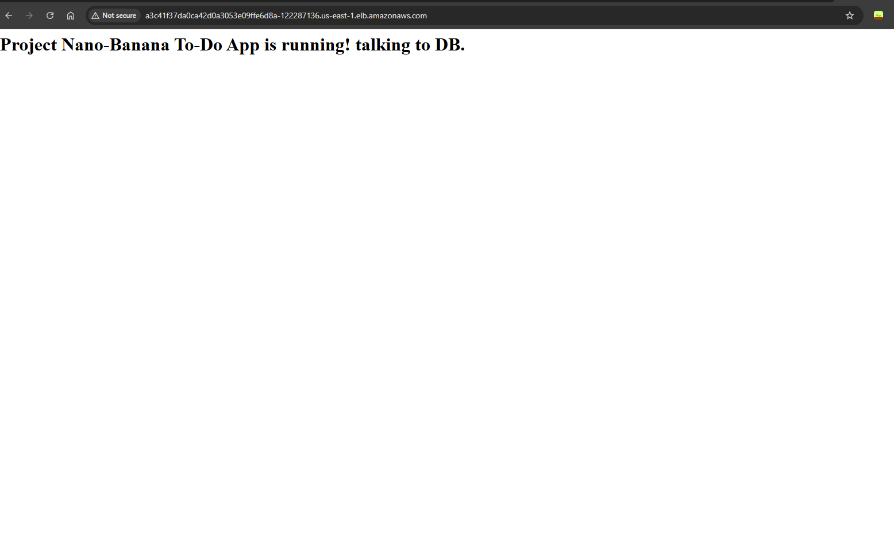
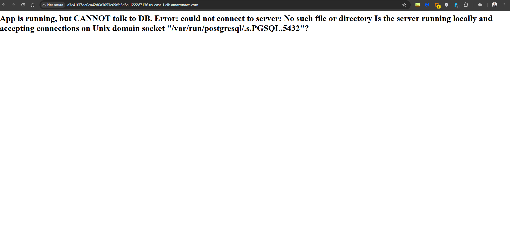

# 🍌 Nano-Banana — End-to-End DevOps Pipeline

> Taking a Python web application from a local `docker-compose up` to a **live, publicly accessible URL on AWS EKS** — fully automated, monitored, and production-grade.


---

## 🗺️ The Full Pipeline at a Glance

```text
  👨‍💻 Developer           🔧 Jenkins              🐳 DockerHub
  ─────────────          ──────────────          ─────────────
  Edit code         →    Pull from GitHub    →   Push image
  git push               Run tests               tag: build-$NUM
                         docker build
                              │
                              ▼
                    ☁️  AWS EKS Cluster
                    ──────────────────────────────────────
                    │  Flask Pod  │◄──── ELB (public URL)
                    │  PgSQL Pod  │◄──── PVC (EBS volume)
                    │  Prometheus │
                    │  Grafana    │◄──── Real-time metrics
                    ──────────────────────────────────────
```

---

## 📁 Project Structure

```text
DevOps-journey/
├── app/                    # Flask application
│   ├── app.py
│   └── requirements.txt
├── Dockerfile              # Container definition
├── docker-compose.yml      # Local dev environment
├── Jenkinsfile             # CI/CD pipeline as code
├── terraform/              # AWS infrastructure (VPC + EKS)
│   ├── main.tf
│   ├── variables.tf
│   └── outputs.tf
├── k8s/                    # Kubernetes manifests
│   ├── flask-deployment.yaml
│   ├── postgres-deployment.yaml
│   └── flask-service.yaml
├── monitoring/             # Helm values for Prometheus stack
└── images/                 # Proof-of-execution screenshots used in this README
```

---

## Phase 1 — Containerisation 🐳

> **Goal:** Package the app and its database into containers and confirm they talk to each other locally before touching any cloud infrastructure.

### What I built

- A `Dockerfile` that packages the Python Flask app with all its dependencies in a reproducible, portable image
- A `docker-compose.yml` that starts both the **web app** and **PostgreSQL** as separate containers on a shared network
- A full local validation flow: app starts, connects to the database, reads data, and writes data correctly

### Result


*Flask app running locally, connected to PostgreSQL — both containers healthy.*

---

## Phase 2 — Infrastructure as Code ☁️

> **Goal:** Stop clicking in the AWS console. Provision the entire cloud environment automatically with a single `terraform apply`.

### What I built

- Modular Terraform code split across `main.tf`, `variables.tf`, and `outputs.tf`
- A custom **AWS VPC** with public and private subnets across multiple availability zones
- A fully managed **AWS EKS cluster** with worker nodes
- Local `kubectl` access to the live cluster, with nodes confirmed as `Ready`

### Why Terraform over clicking in the console

Every resource is version-controlled. A teammate can clone the repo and run `terraform apply` to get an identical environment. `terraform destroy` tears everything down cleanly, reducing the risk of forgotten AWS resources and unexpected cost.

### Result


*Terraform apply completed successfully — EKS nodes showing `Ready` status in `kubectl`.*

---

## Phase 3 — Production Deployment on Kubernetes 🚀

> **Goal:** Deploy the app and database to the live EKS cluster — externally accessible, data-persistent, and credentials secured.

### What I built

- Pushed the Docker image to **DockerHub** so EKS worker nodes can pull it from anywhere
- Wrote Kubernetes `Deployment` and `Service` manifests for both the Flask app and PostgreSQL
- Injected database credentials through runtime environment variables instead of hardcoding them in application code
- Exposed the application to the internet through an **AWS Elastic Load Balancer (ELB)** using a Kubernetes `LoadBalancer` service

### Result

**1 — Docker image available on DockerHub:**


**2 — Kubernetes manifests applied to the live EKS cluster:**


**3 — Application live on public AWS ELB URL and connected to PostgreSQL:**



---

## Phase 4 — CI/CD Automation with Jenkins ⚙️

> **Goal:** Make manual deployments impossible. Every `git push` triggers a full pipeline — test, build, push, deploy. Zero human steps.

### What I built

- A declarative `Jenkinsfile` that defines every stage of the delivery lifecycle as Pipeline-as-Code
- Jenkins pulls from GitHub automatically, builds the Docker image, and pushes it to DockerHub using securely stored credentials
- The final stage sends `kubectl` commands directly to the EKS cluster to roll out the new image — no SSH and no manual deployment steps

### Real challenge I solved — Docker-out-of-Docker (DooD) 🔧

Running `docker build` inside a Jenkins container requires the container to communicate with the host's Docker socket. This caused a socket permission error that stopped the pipeline.

**Fix:** Mounted the host Docker socket into the Jenkins container and added the Jenkins user to the `docker` group. After the fix, the pipeline could build and push images without running as root or installing Docker inside Docker.

### Result


*All stages green — Checkout from GitHub → Build → Push → Deploy.*

---

## Phase 5 — Observability with Prometheus & Grafana 📊

> **Goal:** See what is happening inside the cluster in real time and know quickly if a deployment breaks something.

### What I built

- Used **Helm** to deploy the `kube-prometheus-stack`
- Installed Prometheus, Grafana, Alertmanager, and the required Kubernetes exporters
- Configured the monitoring stack to collect Kubernetes cluster and workload metrics
- Used Grafana to visualize pod CPU/memory usage, restart counts, and node resource consumption during testing

### Real challenge I solved — t3.micro resource constraints 🔧

The `kube-prometheus-stack` requires more memory than very small free-tier nodes can comfortably provide. On `t3.micro` nodes, monitoring pods stayed in `Pending` state because the cluster did not have enough memory and available ENI capacity.

**Diagnosis:** `kubectl describe pod nanobanana ` showed `Insufficient memory` in the Events section, confirming this was a capacity issue rather than a Kubernetes manifest error.

**Fix:** Upgraded the node group to `t3.medium` instances. During constrained testing, I also changed the application deployment strategy from `RollingUpdate` to `Recreate` to avoid running old and new pods at the same time.

### Result

Monitoring was implemented with the `kube-prometheus-stack` Helm chart. The AWS infrastructure was later destroyed to avoid unnecessary cloud cost, so a live Grafana dashboard screenshot is not available.

Command used:

```bash
helm install kube-prometheus-stack prometheus-community/kube-prometheus-stack \
  --namespace monitoring \
  --create-namespace
```

**Operational result:** Prometheus and Grafana were deployed to the EKS monitoring namespace after increasing the node group capacity from `t3.micro` to `t3.medium`.

---

## 🔧 Challenges & Solutions

| Challenge | Root Cause | Solution |
|-----------|------------|----------|
| App could not connect to DB locally | Containers were not communicating correctly through the expected network path | Fixed the Docker Compose networking and validated the app-to-PostgreSQL connection |
| Docker build failed inside Jenkins | Docker socket permission denied inside Jenkins container | Mounted `/var/run/docker.sock` and added the Jenkins user to the Docker group |
| Monitoring pods stuck in `Pending` | `t3.micro` had insufficient RAM and ENI capacity | Upgraded the EKS node group to `t3.medium` |
| Both old and new pods risked high memory usage during rollout | `RollingUpdate` can temporarily double pod count | Used `Recreate` strategy during constrained deployments |
| EKS `kubectl` access from Jenkins | Jenkins needed permission to interact with the cluster | Used AWS IAM access and Kubernetes RBAC through the `aws-auth` configuration |

### Troubleshooting evidence



*Database connection issue captured during troubleshooting before the networking and deployment configuration were corrected.*

---

## 🎯 Key skills demonstrated

- **Infrastructure as Code** — reproducible environments, no console click-ops
- **Pipeline-as-Code** — `Jenkinsfile` stored in version control alongside the application
- **Container orchestration** — Kubernetes deployments, services, environment variables, and rollout strategy
- **Real troubleshooting** — diagnosed and fixed Docker socket permissions, resource constraints, and application connectivity issues
- **Cloud cost awareness** — destroyed AWS infrastructure after testing and made instance-size decisions based on workload requirements
- **Security baseline** — avoided hardcoded credentials in committed application files

---

## 🧰 Full tech stack

| Layer | Technology |
|-------|------------|
| Application | Python · Flask · PostgreSQL |
| Containerisation | Docker · Docker Compose |
| Cloud | AWS EKS · EC2 · VPC · IAM · EBS · ELB |
| Infrastructure as Code | Terraform |
| Orchestration | Kubernetes · Helm |
| CI/CD | Jenkins Declarative Pipeline |
| Monitoring | Prometheus · Grafana · kube-prometheus-stack |

---

## 👤 Author

**Mostafa Mohamed Ahmed** — DevOps Engineer · Cairo, Egypt

[](https://linkedin.com/in/mostafa-muhamed)
[](https://github.com/Musstaphaa)
[](mailto:musstafa.muhammed@gmail.com)
